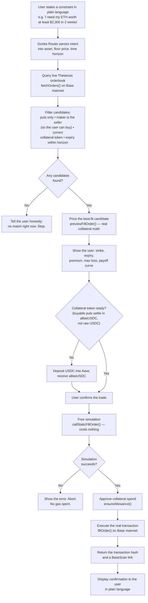

# Payung — Detailed Spec

Companion to [PROJECT.md](PROJECT.md) (pitch, Q&A, track fit) and [src/core.ts](src/core.ts) / [src/cli.ts](src/cli.ts) (the implementation this spec describes). This document defines *how the system behaves*, step by step, so anyone on the team can build any piece of it without guessing.

---

## Summary (plain text, ~300 words)

Payung is an AI-assisted options protection product built on the Thetanuts SDK, running live on Base mainnet, designed to compete in both of Thetanuts' MUBA Hacks 2026 tracks. It solves a specific problem: someone holding a volatile asset like ETH who needs it to be worth at least a certain amount by a certain date has no good tool today. Selling early gives up upside, and a stop-loss can fail exactly when it matters most, filling far below its trigger during a fast crash because it sells into whatever liquidity exists at that moment. Payung instead lets the user state their need in plain language, something like "I need my ETH worth at least $2,300 in two weeks," and finds a real, currently fillable offer on Thetanuts' live orderbook that guarantees exactly that floor through a cash-settled put option. The user's actual ETH is never touched or sold. Instead, the put option is a separate contract that pays out in cash if the price falls below the floor at the deadline, and pays nothing if it doesn't — meaning the user keeps their asset and any upside the whole time, and the floor can't be missed by slippage the way a stop-loss can, because it's computed rather than executed into a live order book. Every number shown to the user, from the premium to the payoff curve, comes directly from the protocol's own live pricing and collateral math, never from a prediction. The AI layer, routed through Gonka Router, only ever does one job: translate the user's stated constraint into the correct instrument and summarize real data, never guess a price. Before any real money moves, the exact transaction is simulated for free against current chain state, so the only trade that costs anything is the one the user actually confirms, and it produces a verifiable transaction hash on BaseScan as proof it happened for real.

---

## Flowchart

## What this flowchart is

It's the exact request lifecycle the code in [src/core.ts](src/core.ts) already implements, from a typed sentence to a real, verifiable transaction. Every node maps to a real function call, not an aspirational step — and several of the decision points exist specifically because testing this against the live Thetanuts book surfaced a way to get it wrong silently.

- **A → B, intent parsing.** The AI's only involvement in the entire flow is here: turning a sentence into three numbers (asset, floor, horizon). It never touches a price after this point.
- **C, live query.** Every candidate the system will ever consider comes from `fetchOrders()` against the real, currently-live Base mainnet book — never a cached or assumed price.
- **D, the filter step — the most important box in the diagram.** Roughly 80% of the live orderbook is orders where *you* would be the seller, not the buyer — filtering this out is what stops the product from accidentally writing naked puts instead of buying protection, which is the opposite of what it claims to do. This filter is why "any candidates found?" is a real question, not a formality — sometimes the honest answer is no.
- **E, the "no match" branch.** The system is built to say "nothing fits right now" rather than force a bad match. That refusal is a feature: it's what stops the AI from ever inventing a price to fill a gap.
- **G–H, pricing and disclosure.** `previewFillOrder()` is the protocol's own collateral math, called directly — the UI never computes a premium itself. The payoff curve shown here is what lets a user (or a judge) see the floor and the cost in one view before committing anything.
- **I–J, the collateral-token branch.** Buyable puts on the live book settle in `aBasUSDC` (Aave-wrapped USDC), not raw USDC — discovered by querying the live book, not assumed from docs. This branch exists so the product doesn't silently fail an approval on a token the user doesn't hold.
- **K, confirmation.** The one deliberate human checkpoint in the flow. Nothing before this spends anything; nothing after this happens without it.
- **L–M, free simulation before real execution.** `callStaticFillOrder()` runs the actual transaction against current chain state without spending gas or collateral. This is what lets the whole product be built and tested for free, and it's what keeps the one real, on-camera transaction from being the first time the exact call has ever been tried.
- **O–P, execution.** Collateral approval targets the specific order's token (not a hardcoded address — the book quotes several), then the real fill happens.
- **Q–R, proof.** The system's output isn't a success message — it's a transaction hash a judge can independently verify on BaseScan.

---

## Functional requirements

| # | Requirement |
|---|---|
| FR1 | Accept a plain-language protection request and parse it into asset, floor price, and time horizon |
| FR2 | Query the live Thetanuts orderbook on Base mainnet — never a cached, mocked, or assumed price |
| FR3 | Only surface candidates where the user is the buyer (protection), never the seller |
| FR4 | Price every candidate using the protocol's own `previewFillOrder()` math — no invented or estimated numbers |
| FR5 | Show a payoff curve and explicit max-loss figure before any confirmation step |
| FR6 | Simulate the exact transaction for free before ever asking to spend real funds |
| FR7 | Execute the real fill only after explicit user confirmation and a successful simulation |
| FR8 | Return a real, independently verifiable transaction hash on execution |
| FR9 | If no live candidate matches the constraint, say so — never approximate or substitute |

## Non-functional requirements / constraints

- **No fabricated numbers, anywhere.** Every price, premium, and payoff figure must trace to a live SDK call. This is the core defensibility claim in the pitch and cannot be quietly violated for a smoother demo.
- **Real funds, real chain.** Base mainnet only. Track 02's bar explicitly disqualifies testnet or paper trading.
- **Security.** All signing uses a burner wallet funded with a small, fixed amount (~$20 USDC), never the team's main wallet. Private keys live only in a gitignored `.env`, never committed.
- **Fail loud, fail cheap.** Any failure before the confirmation step (no candidates, failed simulation) must cost the user nothing — no gas, no partial state.

## Data model (as implemented in `src/core.ts`)

- **`Candidate`** — a single live order, decoded: side (`you buy` / `you sell`), strike, expiry, days to expiry, price per contract, collateral token, maker's remaining budget, greeks.
- **`ProtectionSpec`** — the parsed user intent: asset, floor price (USD), horizon (days).
- **`Quote`** — a priced candidate: collateral required, contracts, premium, strike, expiry, side, and the raw SDK preview object.

## Edge cases & failure modes

| Case | Behavior |
|---|---|
| No live order matches the constraint | Return an explicit "no match" — do not substitute the nearest option silently |
| Simulation (`callStaticFillOrder`) reverts | Show the revert reason, abort before spending gas |
| User lacks the required collateral token (e.g. no `aBasUSDC`) | Prompt the Aave deposit step before allowing confirmation |
| Order expires between quoting and confirming | Re-check `order.expiry` immediately before execution; re-quote if stale |
| Maker's available budget is less than requested collateral | Cap the fill to `availableAmount`, show the adjusted quote, do not silently round |

## Out of scope (for the hackathon build)

- Multi-asset portfolios or automatic rebalancing beyond a single stated constraint
- Physical settlement flows (Payung uses OptionBook's cash-settled puts only)
- Custody of user funds beyond the single approved allowance for one trade
- Support for collateral tokens beyond what the live book actually quotes

## Questions asked while scoping this project (and the short answers)

**Q: "I still don't understand what is this project about, explain to me in plain text and simple words, and give me an example"**
A: You hold crypto, its price can crash without warning. Payung lets you say "I need this to be worth at least $X by date Y," finds a real offer on a live marketplace that guarantees that, shows you the cost, and executes it for real on Base mainnet. Example: hold 1 ETH worth $2,450, need $2,300 in two weeks, pay a small premium now, and no matter what happens you're guaranteed $2,300 at the deadline.

**Q: "this is just sounds like a stop loss, which currently has this feature, whats so special about this"**
A: A stop-loss is a best-effort order that tries to sell at a trigger price — in a fast crash it can fill well below that price because the order book is thin at that exact moment, which happens constantly in crypto. This is a contractual floor that's computed at a deadline, not executed into a live market, so it can't suffer that slippage. It also doesn't take you out of your position — you keep the asset and any recovery, whereas a triggered stop-loss sells you out and you miss the bounce.

**Q: "What do you mean never sold your ETH? If the price dips to 2300, why? Because you can choose to not sell?"**
A: There's no choice involved because there's no selling at all — the put is a separate, cash-settled side contract that never touches your real ETH. It automatically pays you cash equal to the difference between the floor and the market price at the deadline, and your actual ETH sits untouched in your wallet the entire time.

**Q: "the $4.62 is that a real figure price? What is that price? Will the price be higher than 4.62 until it does not make sense to buy it at all?"**
A: Yes, real, pulled from the live Thetanuts orderbook on Base — though the first example mismatched a strike and its premium, corrected in the pricing table in [PROJECT.md](PROJECT.md). The price climbs the closer your floor is to the current market price, roughly 10x from a far-out floor to a near-the-money one, because a closer floor is more likely to actually pay out. There is a real ceiling: once the premium eats a large share of what you're protecting, you're better off not buying it — you'd be paying more for the insurance than the insurance is worth.

---

## Open items

- Which specific expiries/strikes to default to when several candidates tie on fit
- Exact UX for the Aave deposit step (in-app vs. "go deposit first" instruction)
- Whether the autonomous re-hedge rule (Track 02's "autonomous hedging agent" idea) ships for the hackathon or is described as a roadmap item
