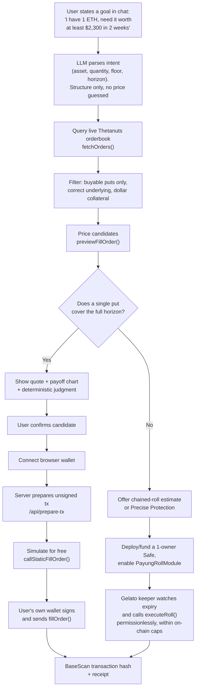
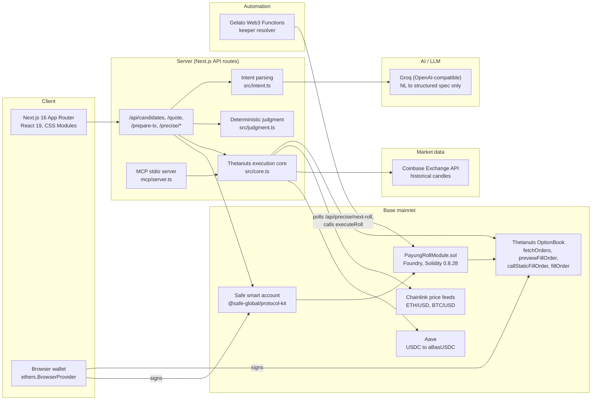

# ☂ Payung

*Payung* is Malay for "umbrella." You buy protection before it rains.

Payung lets a crypto holder state a plain-language goal, like "I need my ETH worth at
least $2,300 in two weeks," and turns it into a real put option purchased on the live
Thetanuts orderbook on Base mainnet. No strike, expiry, or Greeks to configure by hand.

Built for **MUBA Hacks 2026**, targeting Thetanuts Track 01 (SDK Product) and Track 02
(AI × Options).

**Proof of a live execution:** [`0x616bafff…ab273bc`](https://basescan.org/tx/0x616bafff6255ff448d71feff9e0ab743f94bdd41c3d9d04941046ef92ab273bc)
on Base mainnet, block 50732577. 0.000499 ETH of protection, $2,200 strike, expiring
2026-09-25, for a $0.004704 premium pulled straight from the fill receipt's own Transfer
logs. Checked against the option contract's own `buyer()`/`seller()` view functions, not
just the emitted event.

## The problem

Crypto derivatives are already a large, active market, but a holder who wants downside
protection has two bad options today:

- **Sell the asset.** You stop the loss, but you also give up any recovery.
- **Place a stop-loss.** It only guarantees an attempt to sell at your trigger price, not
  the price itself. In a fast crash the order book thins out and the fill lands well
  below the trigger, a common failure mode in crypto.

Cash-settled put options solve this properly: a contractual floor, computed at a fixed
date, that never requires selling the underlying asset. The catch is that on-chain
options infrastructure solves *execution*, not *translation*. A holder who just wants
"ETH worth at least $2,300 by the 20th" still has to pick a strike, an expiry, a side,
and a size themselves before any existing platform will let them act.

Payung closes that gap: state the goal, get the trade.

## How the trade actually works

1. **State a constraint** in plain language: asset, floor price, time horizon.
2. **Payung queries the live Thetanuts orderbook** (`fetchOrders()`) and filters to puts
   that are actually buyable. Only about a fifth of the live book has the market maker
   as buyer, meaning you're the one being offered protection rather than asked to sell
   it, so that filter matters.
3. **The match is priced with the protocol's own math**, `previewFillOrder()`, never an
   estimate. Premium, collateral, and contract size all come from the live book.
4. **The fill is simulated for free** with `callStaticFillOrder()` before anything real
   happens, so a failure shows up before any gas is spent.
5. **Only your own wallet signs.** Payung's server prepares an unsigned transaction
   (`/api/prepare-tx`); your browser wallet reviews and executes it. Payung never holds
   a key that can spend your funds.
6. **You get a BaseScan transaction hash** you can verify independently, including
   directly against the option contract's own `buyer()`/`seller()` view functions.

The put itself is a separate, cash-settled side contract. Your ETH sits in your wallet
untouched the whole time. If ETH lands below your floor at expiry, the contract pays you
the difference in cash. If it lands above, the contract expires worthless and you keep
the asset plus any upside, having spent only the premium.

### When one put isn't enough: Precise Protection

Sometimes the requested horizon is longer than any single put on the book, say 90 days
when only 7 to 14 day puts are trading. For that case, Payung offers **Precise
Protection**: the user deploys a one-owner Safe smart-contract wallet, funds it with a
roll budget, and enables [`PayungRollModule.sol`](contracts/src/PayungRollModule.sol)
with hard on-chain limits (deadline, max rolls, max premium per roll, total spend cap). A
Gelato Web3 Function keeper then watches the position and calls a permissionless
`executeRoll()` as each leg nears expiry, buying the next one automatically until the
horizon is covered or the user cancels. The Safe is the buyer and owner of every
resulting option; Payung's own key never signs a transaction that spends the user's
money.

## How AI is applied

The model has exactly one job: transcribe a sentence into a strict, validated structure,
`{asset, quantity, floorTotalUsd, horizonDays}`. It is not allowed to divide, multiply,
price anything, or predict where the market is going. Every number the user sees, quote,
premium, spot price, chart candle, and payoff figure, traces back to a live SDK call, a
Chainlink price feed, or a Coinbase candle endpoint. Judgment calls like "is this premium
worth it" or "nothing on the book actually covers this" are computed by deterministic
code (`src/judgment.ts`), not the model.

That constraint is deliberate: an LLM has no real edge on price direction, so a product
that lets it guess a number would just be a coin flip with extra steps. Payung's model
never gets the chance to be wrong about a price, because it never states one.

## Flow



## Tech stack



| Layer | Choice |
|---|---|
| Framework / UI | Next.js 16 (App Router), React 19, TypeScript, CSS Modules |
| Chain SDK | `@thetanuts-finance/thetanuts-client`, isolated to `src/core.ts` |
| Chain interaction | `ethers` v6 |
| Chain | Base mainnet (chainId 8453) |
| Smart accounts | Safe (`@safe-global/protocol-kit`) |
| Smart contracts | Solidity 0.8.28, Foundry (`contracts/`) |
| Keeper automation | Gelato Web3 Functions (`@gelatonetwork/web3-functions-sdk`, `@gelatonetwork/automate-sdk`) |
| AI / LLM | Groq, OpenAI-compatible, used only for natural-language-to-spec parsing |
| Price feeds | Chainlink (spot), Coinbase Exchange API (historical candles) |
| Yield | Aave, auto-deposits idle USDC into aBasUSDC when an order needs it |
| Protocol interface | Model Context Protocol server (`mcp/server.ts`) over the same tool registry the chat UI uses |
| Testing | Vitest (TypeScript, pure functions, no network) + Foundry (Solidity) |

No database. No auth system. On-chain contracts and the Thetanuts positions indexer are
the only sources of truth.

## Run it

```bash
npm install
cp .env.example .env   # Base RPC + Groq key; Precise Protection vars are optional
npm test                # pure-function tests, no network
npm run dev             # http://localhost:8787
```

The chat flow at `/protect` works with zero wallet connection up through getting a quote
and a payoff chart. Confirming and executing a purchase requires connecting a browser
wallet, since that wallet is the one that signs and pays.

## Project layout

```
src/
  core.ts        the only module that touches the Thetanuts SDK
  intent.ts      natural language to ProtectionSpec, via Groq
  judgment.ts    deterministic premium-vs-value verdict
  blackscholes.ts  pricing math for chained-roll estimates
  watcher.ts     position reader and roll-evaluation engine
  tools.ts       shared tool registry used by the chat UI, CLI agent, and MCP server
contracts/
  src/PayungRollModule.sol   Safe module for Precise Protection auto-rolls
app/
  protect/       the chat-driven protection flow
  my-protection/ active positions and Precise Protection status
  api/           Next.js route handlers over src/core.ts
gelato/
  resolver.ts    Web3 Function keeper for Precise Protection rolls
mcp/
  server.ts      MCP stdio server over the same tool registry
```

Further detail: [HANDOFF.md](HANDOFF.md) for architecture and design rules,
[Payung_Spec.md](Payung_Spec.md) for the behavioral spec, [PROJECT.md](PROJECT.md) for
the full problem-statement writeup and pricing data pulled from the live book.
